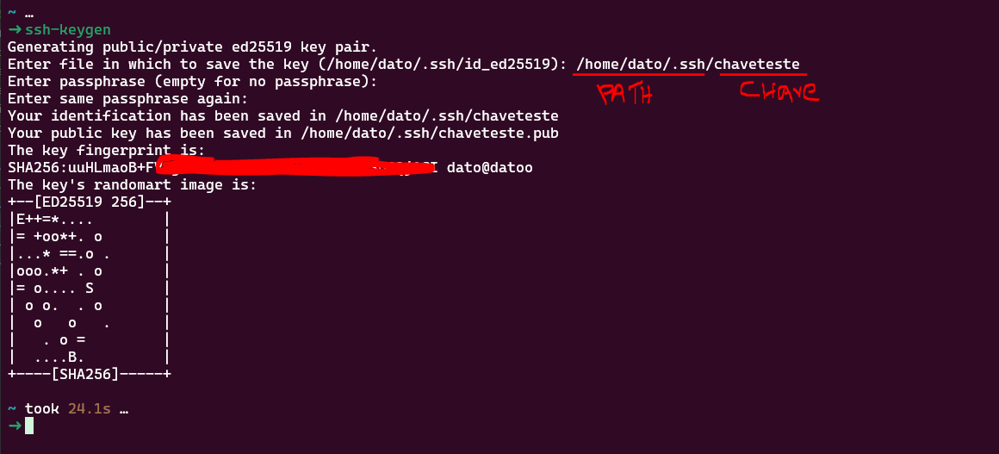
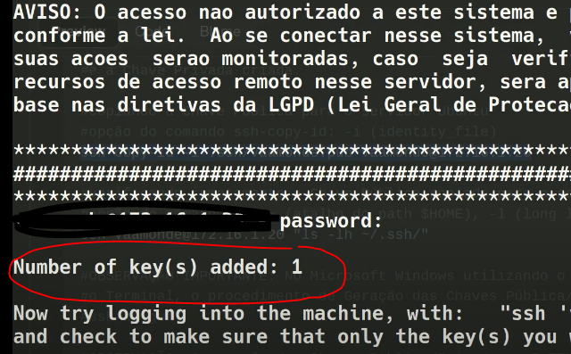

# Intrução SSL 

`O que é SSL`

1. SSL (Secure Sockets Layer) é um protocolo de criptografia que garante que dados transmitidos entre cliente e servidor via internet fiquem protegidos.
2. O sucessor do SSL é o TLS (Transport Layer Security), mas muita gente ainda chama de “SSL”.
3. Ele é amplamente usado em HTTPS, e a ideia é a mesma para SSH: criptografar a comunicação para evitar espionagem ou alteração de dados.

> ⚠ OBSERVAÇÂO:Em servidores Linux com SSH, não usamos diretamente “SSL”, e sim chaves SSH, que também usam criptografia assimétrica (par de chave pública e privada) para autenticar de forma segura.


```css
┌───────────┐      Internet/LAN       ┌────────────┐
│ Laptop    │────────────────────────►│            │
│ PC Interno│────────────────────────►│  Servidor  │
│ Celular   │────────────────────────►│            │
└───────────┘                         └────────────┘
Cada cliente → chave própria → chave pública em ~/.ssh/authorized_keys
```


```bash
# gerando o par de chaves Pública/Privada no perfil do usuário local
ssh-keygen

    # apos irá solicitar a chave, seapenas digitar o valor da chave irá salvar no diretorio atual
    # mas podemos passar ja o path+nome onde queremos salvar exemplo: cd/home/dato/pasta/<VALOR DACHAVE>
    Generating public/private ed25519 key pair.
    Enter file in which to save the key (/c/Users/datoc/.ssh/id_ed25519): <INSERIR AQUI>

    # é possivel inserir uma senha tbm, mas geralmnte as aplicações nãi lidam muito bem
    Enter passphrase (empty for no passphrase):
    Enter same passphrase again:
```

65

```bash
#verificando as chaves criadas no perfil do usuário local
#opção do comando ls: ~ (atalho do path $HOME), -l (long listing), -h (human readable), * (curinga qualquer coisa)
ls -lh ~/.ssh/chaveteste*
```

> OBSERVAÇÃO IMPORTANTE: arquivo `chaveteste.pub` é a Chave Pública criada e o arquivo `chaveteste` a Chave Privada.


## Proxima etapa é copiar a identificação da chave publica para o servidor

via comando 

```bash 

#copiando a Chave Pública para o servidor Ubuntu
#opção do comando ssh-copy-id: -i (identity_file)
ssh-copy-id -i <DIRETORIO_DA_CHAVE>/<NOME_DA-CHAVE>.pub <USUARIO_SERVIDOR>@<IP_SERVIDOR>
```


ou manualmente:
```bash 
ssh usuario@IP_DO_SERVIDOR
mkdir -p ~/.ssh
echo "conteúdo_da_sua_chave_publica" >> ~/.ssh/authorized_keys
chmod 700 ~/.ssh
chmod 600 ~/.ssh/authorized_keys

# no nosso exemplo ficaria 
ssh-copy-id -i .ssh/chaveteste.pub <USUARIO>@<IP_SERVIDOR>

#verificando remotamente a Chave Pública copiada para o servidor Ubuntu
#opção do comando ls: ~ (atalho do path $HOME), -l (long listing), -h (human readable), * (curinga qualquer coisa)
ssh vaamonde@172.16.1.20 "ls -lh ~/.ssh/"

#OBSERVAÇÃO IMPORTANTE: No Microsoft Windows utilizando o Powershell ou no macOS utilizando
#o Terminal, o procedimento de Geração das Chaves Pública/Privada utiliza o mesmo comando: 
#ssh-keygen.
```

# via Putty

Link de download do PuTTY: 

https://www.chiark.greenend.org.uk/~sgtatham/putty/latest.html

> OBSERVAÇÃO: A geração das Chaves Pública/Privada no PuTTY segue o mesmo padrão do comando: 
```bash
ssh-keygen, sua utilização é mais simples, seguindo o procedimento abaixo:

Windows
  Pesquisa do Windows
    PuTTYgen
      <Generate>
        #OBSERVAÇÃO IMPORTANTE: PARA GERAR O PAR DE CHAVES PÚBLICA/PRIVADA UTILIZANDO O
        #PUTTYGEN, APÓS CLICAR EM: <GENERATE> VOCÊ PRECISAR MOVIMENTAR O MOUSE DENTRO
        #DA ÁREA EM BRANCO (MOVING THE MOUSE OVER THE BLANK AREA) PARA INICIAR O PROCESSO 
        #DE GERAÇÃO DAS CHAVES.
        <Save public key>
          C:\Users\vaamonde\.ssh\vaamonde.pub
        <Save private key>
          <YES>
        C:\Users\vaamonde\.ssh\vaamonde
```

# 04_ Importando o Par de Chaves Pública/Privada utilizando o Powershell (Windows 10)

> OBSERVAÇÃO IMPORTANTE: se você fez a geração das Chaves Pública/Privada utilizando o GNU/Linux,#para importar essas chaves em outro equipamento você precisar enviar a chaves por email, pendrive, servidor de arquivos, servidor web, etc... MUITO CUIDADO COM O ENVIO DAS CHAVES, POIS SE A MESMA VAZAR (SER DESCOBERTA OU ENVIADA PARA OUTRA PESSOA) O PROCESSO DE SEGURANÇA SERÁ COMPROMETIDO.

```powershell

Windows
  Powershell: 
    Menu:
      Powershell 

Primeira etapa: clicar com o botão direito do mouse e selecionar: Abrir como Administrador

#verificando o status do serviço do SSH-Agent
Get-Service ssh-agent

#alterar a inicialização do serviço do SSH-Agent
Set-Service ssh-agent -StartupType Automatic (Ou mudar para: Manual)

#iniciar o serviço do SSH-Agent
Start-Service ssh-agent

#saindo do Powershell
exit

#OBSERVAÇÃO IMPORTANTE: Copiar a Chave Privada para o diretório padrão de Chaves do SSH no
#Perfil do Usuário do Windows 10 em: C:\Users\SEU_USUÁRIO\.ssh

Segunda etapa: Powershell do perfil do usuário sem ser como administrador

#acessar o diretório das chaves Pública/Privadas do SSH
cd C:\Users\dato\.ssh

#listar o conteúdo do diretório
ls

#adicionar a chave privada no perfil do seu usuário
ssh-add .\dato
```

# Configurar o SSH para Permitir Chave + Senha

No servidor, edite o arquivo de configuração em:
```bash
sudo nano /etc/ssh/sshd_config
```

```bash
# Verifique/ajuste as seguintes linhas:

PubkeyAuthentication yes
PasswordAuthentication yes
ChallengeResponseAuthentication no
AuthenticationMethods publickey,password

```
> ⚠ AuthenticationMethods publickey,password força que o login só seja aceito quando a chave privada correta e a senha do usuário forem fornecidas.

Salve e reinicie o serviço:
```bash
sudo systemctl restart sshd
```


# editando o arquivo de configuração do TCPWrappers Hosts.Deny

```bash
sudo vim /etc/hosts.deny
INSERT

	# alterar as informações na linha 17
	# mais informações veja o arquivo Hosts.Deny no Github:
	# opção do comando date: -u (universal)
	ALL: ALL: spawn /bin/echo "$(date -u) | Serviço Remoto %d | Host Remoto %c | Porta Remota %r | Processo Local %p" >> /var/log/hosts-deny.log

#editando o arquivo de configuração do TCPWrappers Hosts.Allow
sudo vim /etc/hosts.allow
INSERT

	# alterar as informações na linha 10
	# OBSERVAÇÃO: ALTERAR A REDE CONFORME A SUA NECESSIDADE
	# mais informações veja o arquivo Hosts.Allow no Github:
	# opção do comando date: -u (universal)
	sshd: <IP_DO-HOST_1>, <IP_DO-HOST_2>, <IP_DO-HOST_3>: spawn /bin/echo "$(date -u) | Serviço Remoto %d | Host Remoto %c | Porta Remota %r | Processo Local %p" >> /var/log/hosts-allow.log

#reiniciar o serviço do OpenSSH Server
sudo systemctl restart ssh
sudo systemctl status ssh

#analisando os Log's e mensagens de erro do Servidor do OpenSSH
#opção do comando journalctl: -t (identifier), x (catalog), e (pager-end), u (unit)
sudo journalctl -t sshd
sudo journalctl -xeu ssh

#verificando os Log's de acesso remoto do servidor Ubuntu
#opção do comando cat: -n (number line)
#opção do comando grep: -i (ignore-case)
#opção do redirecionador | (pipe): Conecta a saída padrão com a entrada padrão de outro comando
sudo cat -n /var/log/auth.log | grep ssh
sudo cat -n /var/log/syslog | grep ssh
sudo cat -n /var/log/hosts-deny.log
sudo cat -n /var/log/hosts-allow.log
sudo cat -n /var/log/ufw.log | grep -i dpt=22